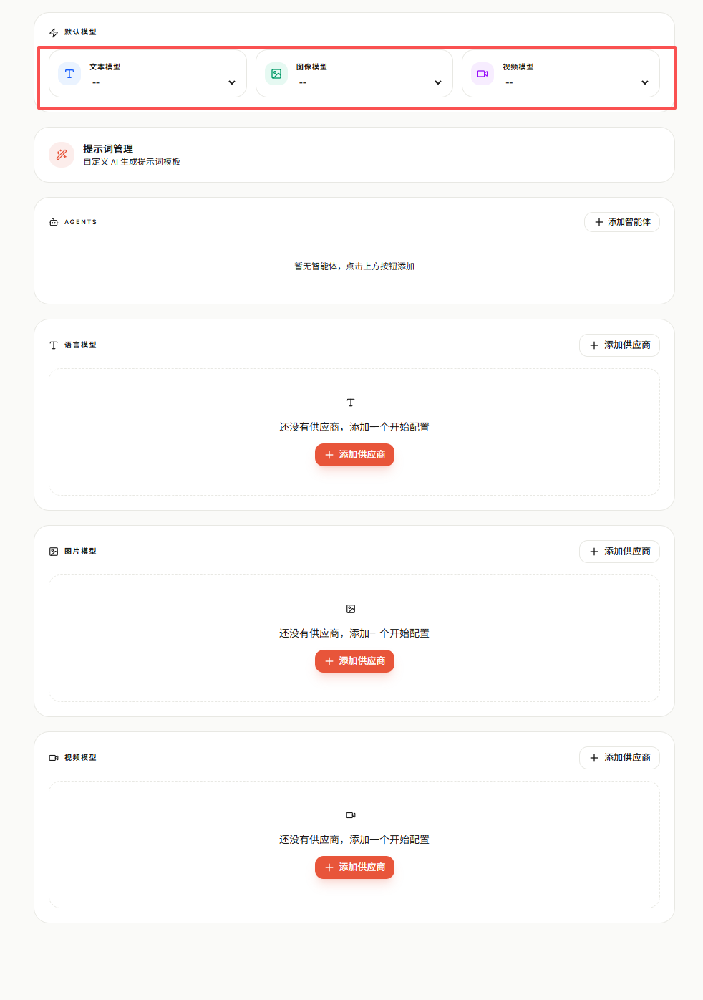
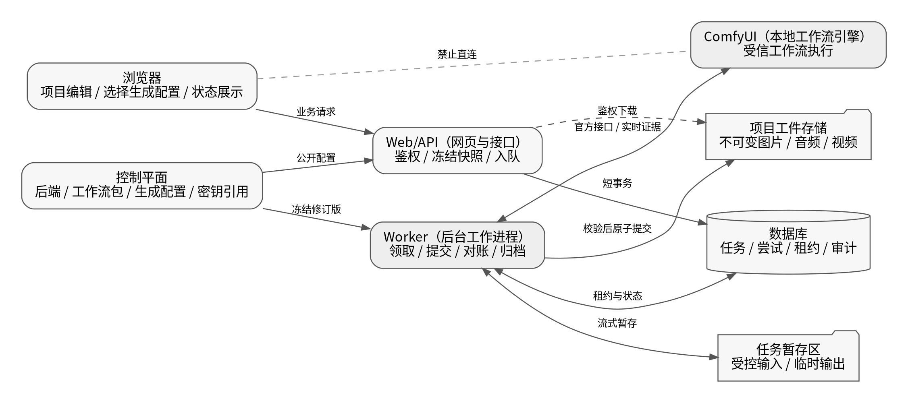
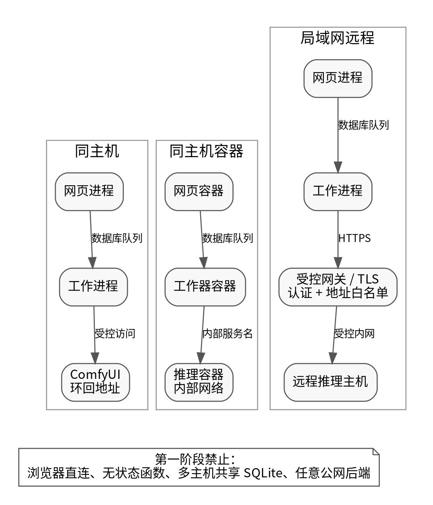
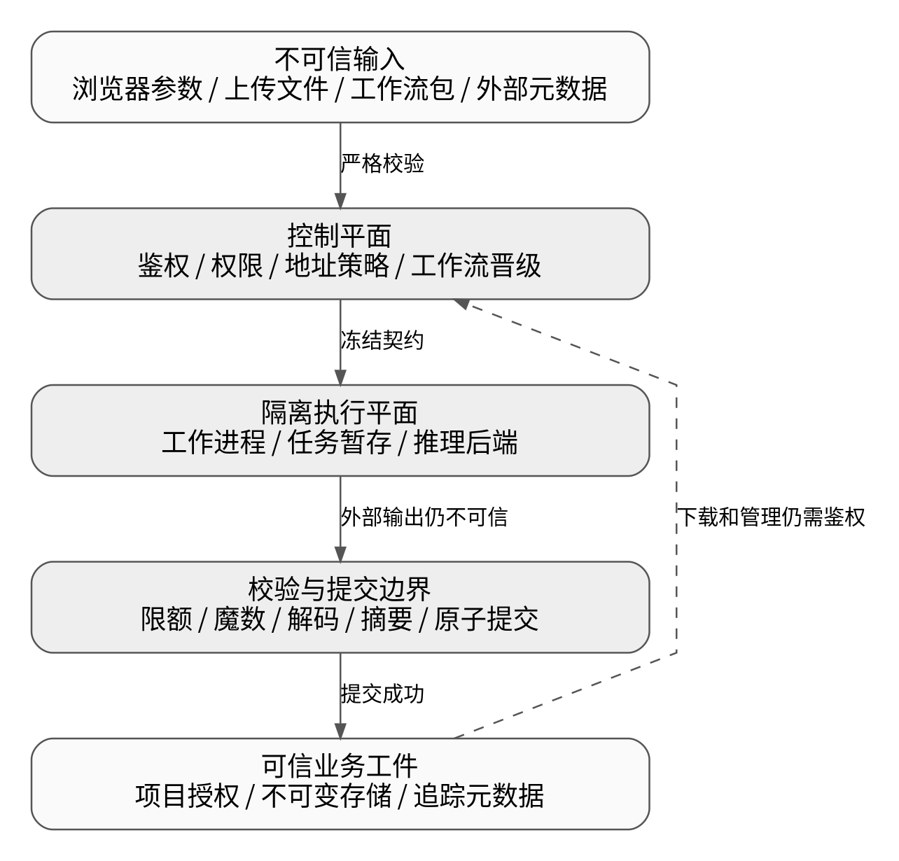
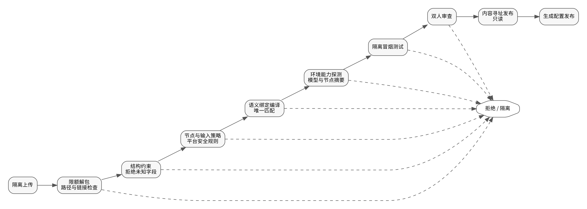
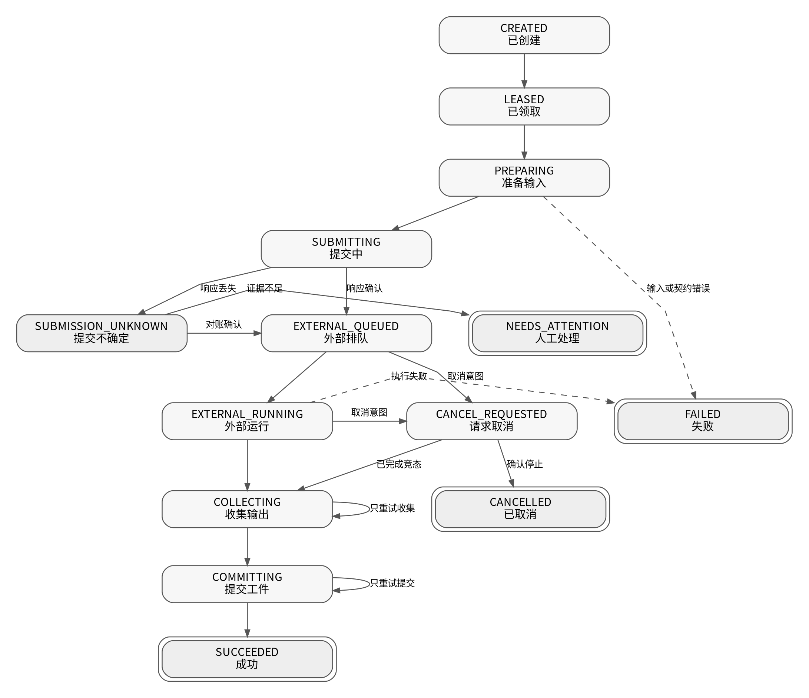

# `ai-m`（当前二开项目）本地 `ComfyUI`（本地工作流引擎）平台开发与执行手册

**文档版本：** 2.0  
**编制日期：** 2026-07-12  
**目标仓库：** `beyondchenlin/ai-m`（当前二开项目）  
**目标分支：** `dev`（开发集成分支）  
**参考实现：** `beyondchenlin/Pixelle-Video`（短视频生成项目）`dev`（开发分支）  
**审查方法：** 第一性原理、两轮对抗式审查、故障注入、兼容性逆推、安全威胁建模、供应链审查  
**第一阶段交付：** 建成可复用的本地工作流平台，并以 `Z-Image`（造相文生图模型）完成图片生成闭环。  
**后续能力：** 视觉主体一致性、`IndexTTS2`（声音克隆模型）、`OmniVoice`（多语言声音模型）、本地与云端视频能力。

> 本文档不是在旧模型设置上增加一个地址输入框，也不是把工作流编号塞进现有模型编号。它从凭据、任务、工作流供应链、资源调度、媒体归档和兼容迁移的根因出发，定义一个可长期承载图片、声音和视频的执行平台。

---

## 文档导航

1. 执行摘要与不可妥协原则  
2. 第一性原理与系统不变量  
3. 当前代码基线和根因  
4. 统一术语与领域对象  
5. 目标架构与进程边界  
6. 部署拓扑与信任边界  
7. 供应商能力接口重构  
8. 服务端控制平面  
9. 工作流包、编译和环境锁  
10. `ComfyUI`（本地工作流引擎）传输与特性探测  
11. 持久任务、执行尝试和工件  
12. 数据库结构与原子领取  
13. 资源调度、租约和防旧写  
14. 状态机、恢复、重试与取消  
15. 媒体输入输出与原子归档  
16. 服务端接口与权限边界  
17. 设置页面与生成配置体验  
18. `Z-Image`（造相文生图模型）接入  
19. 原漫剧兼容与旧配置迁移  
20. 安全基线与威胁控制  
21. 性能与容量规划  
22. 可观测性与审计  
23. 测试、故障注入和验收  
24. 本地开发与隔离部署  
25. 分阶段开发与拉取请求  
26. 完成定义  
27. 运维与故障排查  
28. 参考图、声音和短视频演进  
29. 参考资料与附录

---

# 1. 执行摘要与不可妥协原则

## 1.1 最终技术结论

推荐采用以下组合，而不是完整复制任一现有项目：

- `ComfyUI`（本地工作流引擎）官方服务接口作为协议事实；
- `ai-m`（当前二开项目）自己的服务端控制平面、持久工作进程、任务数据库和工件存储；
- `Pixelle-Video`（短视频生成项目）的工作流契约、能力声明、参考资源语义和长文本声音经验；
- 可替换的 `TypeScript`（类型脚本语言）传输适配器；第三方客户端只能位于基础设施边界内；
- 不可变工作流包和生成配置修订版；
- 以数据库租约和防旧写令牌保护显卡资源；
- 以流式、限额、内容检测和摘要校验保护媒体输入输出。

## 1.2 十条不可妥协原则

1. **浏览器不保存执行密钥，也不能给任务指定任意执行地址。**
2. **网页请求只负责鉴权、校验和入队，绝不等待长推理。**
3. **逻辑任务、执行尝试、外部任务和媒体工件必须分开建模。**
4. **系统不承诺跨进程、跨网络和外部引擎的“恰好一次”。** 对不可判定提交必须显式进入人工处理状态。
5. **外部历史和实时消息只是证据，不是项目数据库的最终事实。**
6. **工作流和自定义节点属于可执行供应链，不属于普通用户模板。**
7. **每个任务冻结不可变执行快照。** 默认配置变化不得改变排队中或重试中的任务。
8. **所有输出先进入暂存区，经流式校验和原子提交后才成为工件。**
9. **进程内锁不能保护显卡。** 资源所有权必须持久化并带防旧写令牌。
10. **原漫剧业务语义保持不变。** 兼容由适配层和回归测试保证，不靠复制旧分支。

## 1.3 第一阶段交付结果

第一阶段完成后，系统应当具备：

- 管理员在服务端登记一个或多个受控执行后端；
- 安装、验证、审查和发布不可变工作流包；
- 发布“本地造相快速预览”和“本地造相质量生成”等生成配置；
- 原角色四视图、首尾帧、场景参考帧入口可以选择本地生成配置；
- 独立工作进程可领取任务、获取资源租约、提交、观察、恢复和归档；
- 网页进程或工作进程重启后，任务不会无条件重复提交；
- 工作流成功但归档失败时，只重试归档，不重新运行模型；
- 输出归档到项目自有目录，数据库不依赖工作流引擎绝对路径；
- 云端文本、图片和视频能力保持可用；
- 本地语音和短视频能力可复用同一基础设施。

---

# 2. 第一性原理与系统不变量

## 2.1 用户真正需要的是可用工件

用户不是在购买一次 `/prompt`（任务提交接口）调用，而是在等待一张能在项目中继续编辑、下载、追溯和重新生成的图片。完整成功必须同时满足：

1. 输入属于当前用户和项目；
2. 使用的是用户选择时冻结的生成配置；
3. 外部执行确实完成；
4. 输出字节经过格式、大小和内容校验；
5. 输出被可靠归档到系统控制的存储；
6. 数据库状态与工件提交位点一致；
7. 用户有权读取该工件；
8. 生成参数和环境可追溯。

因此“外部引擎显示完成”不等于“业务任务成功”。

## 2.2 外部组件可能失败、延迟或给出不完整证据

必须假设以下情况都会发生：

- 请求在服务端收到后、响应到达前断线；
- 实时连接漏消息、乱序、重复或断开；
- 外部历史被清理；
- 外部队列被其他客户端修改；
- 自定义节点返回恶意文件名、巨大文件或伪造媒体类型；
- 工作进程在任意状态转换之间被终止；
- 数据库暂时被锁；
- 磁盘在写入一半时耗尽；
- 管理员更新了工作流、后端或模型；
- 同一显卡被不同能力竞争；
- 取消请求与执行完成同时发生。

设计必须在这些条件下仍保持数据不被覆盖、权限不被绕过、任务不被盲目重复。

## 2.3 提交副作用的不可判定窗口

网络调用存在一个根本事实：客户端可能不知道服务端是否已经接收副作用。正确处理方式是：

- 在网络提交前生成并持久化本地关联编号；
- 对经行为探测确认支持客户端任务编号的 `ComfyUI`（本地工作流引擎）后端，预分配外部任务编号并随提交发送；
- 禁止提交请求的自动重试中间件和自动重定向；
- 响应丢失时，优先使用相同编号对账；
- 在对账宽限期内找不到证据时，进入 `SUBMISSION_UNKNOWN`（提交不确定）或 `NEEDS_ATTENTION`（需要人工处理），不盲目创建第二个外部任务；
- 对不支持客户端编号的适配器，明确记录其较弱的恢复语义。

这不是“恰好一次”，而是“可证明的关联、保守的恢复和显式的不确定”。

## 2.4 安全边界优先于配置便利

本地地址也不是天然安全。只要浏览器能让服务端访问任意地址，就可能形成服务端请求伪造。只要用户能安装任意自定义节点，就等于提供代码执行。只要完整项目上传目录挂载给工作流引擎，节点就可能读取不相关项目的私有素材。

因此：

- 后端只能由管理员登记；
- 普通用户只能引用公开的生成配置编号；
- 工作流包必须经过供应链晋级；
- 执行容器只挂载当前任务所需的暂存文件；
- 远程后端必须启用传输加密和认证；
- 输出字节永远不因“来自本机”而跳过校验。

---

# 3. 当前代码基线和根因

## 3.1 可复用能力

当前项目已有：

- 项目、分集、角色、分镜和媒体资源；
- 角色参考图和参考图历史；
- 首尾帧、场景参考帧和视频生成；
- 后台任务概念；
- 云端文本、图片和视频供应商；
- 默认文本、图片和视频模型选择；
- 图片请求中的参考图和标签；
- `FFmpeg`（音视频处理工具）合成能力。

这些是业务资产，应保留其语义和页面入口。

## 3.2 接口根因

现有 `AIProvider`（人工智能供应商接口）把文本与图片合并，导致纯图片后端必须实现无意义的文本方法。后续声音、音乐、音效和视频编辑会继续放大问题。

根因不是缺少一个 `comfyui`（本地工作流协议）分支，而是能力抽象与供应商品牌耦合。

## 3.3 设置根因



现有浏览器状态同时保存：

- 供应商地址；
- 接口密钥；
- 协议；
- 模型列表；
- 默认模型。

这把执行凭据、物理后端、用户可选方案和界面偏好混成一个对象。直接扩展会带来密钥泄漏、任意地址访问和历史任务漂移。

## 3.4 任务根因

本地推理和云端视频都是长任务。若只在现有业务任务表增加外部编号、进度和重试次数，会混淆：

- 用户逻辑请求；
- 某次外部提交；
- 外部运行；
- 输出收集；
- 工件提交；
- 归档重试；
- 业务重试。

根因是缺少执行领域，而不是缺少几个状态字段。

## 3.5 `Pixelle-Video`（短视频生成项目）的正确参考方式

应迁移：

- 工作流能力声明；
- 必填参数契约；
- 参考图片角色与注入策略；
- 工作流家族和版本；
- 生成追踪；
- 长文本旁白分块；
- 实际音频时长；
- 资产圣经与视觉主体思想。

不应迁移：

- 作为生产依赖的第二套 `Python`（蟒蛇语言）服务；
- 与 `ai-m`（当前二开项目）重复的项目、任务和文件管理；
- 难以统一鉴权、日志和恢复的跨服务业务状态。

---

# 4. 统一术语与领域对象

## 4.1 术语表

| 术语 | 正确定义 | 不应混用为 |
|---|---|---|
| `Capability`（能力） | 文本、图片、视频、语音等业务能力 | 供应商名字 |
| `ProviderAdapter`（供应商适配器） | 实现一种协议的代码 | 具体后端地址 |
| `ExecutionBackend`（执行后端） | 地址、认证、网络策略和资源池配置 | 工作流或模型 |
| `WorkflowPackageRevision`（工作流包修订版） | 不可变工作流、清单、绑定和锁文件 | 可随意编辑的模板 |
| `GenerationProfileRevision`（生成配置修订版） | 用户可选的完整生成方案 | 单个权重文件 |
| `GenerationJob`（生成任务） | 用户期望得到一个工件的逻辑请求 | 某次网络调用 |
| `GenerationAttempt`（执行尝试） | 一次具体外部执行或收集尝试 | 逻辑任务全部历史 |
| `Artifact`（工件） | 已校验并归档的不可变媒体文件 | 外部临时路径 |
| `ResourcePool`（资源池） | 一组共享显卡或互斥资源 | 单个工作进程 |
| `Lease`（租约） | 有期限的持有权 | 进程内锁 |
| `FencingToken`（防旧写令牌） | 单调递增、阻止过期工作器写入的序号 | 随机锁编号 |
| `ExecutionSnapshot`（执行快照） | 任务创建时冻结的全部执行输入 | 实时默认设置 |

## 4.2 生成配置修订版

界面仍可显示“默认图片模型”，但内部应保存生成配置修订版编号。生成配置包含：

- 能力；
- 供应商适配器；
- 执行后端选择策略；
- 工作流包修订版；
- 参数默认值与允许覆盖项；
- 宽高策略；
- 参考图策略；
- 超时、重试和取消策略；
- 输出限制；
- 安全策略版本；
- 可见范围。

修订版不可原地修改。修改会创建新修订版，旧任务继续引用旧修订版。

---

# 5. 目标架构与进程边界



## 5.1 浏览器

负责：

- 项目编辑；
- 选择公开生成配置；
- 上传业务输入；
- 发起任务、取消和显式重试意图；
- 展示状态和工件。

不得：

- 保存后端密钥；
- 指定任意执行地址；
- 直接连接本地工作流端口；
- 编译工作流；
- 判定最终成功。

## 5.2 `Web/API`（网页与接口）进程

负责：

- 鉴权、授权和跨站请求伪造防护；
- 业务校验；
- 解析生成配置；
- 冻结执行快照；
- 创建逻辑任务；
- 查询状态；
- 提供受控工件访问。

不得：

- 在请求生命周期内等待显卡推理；
- 持有资源锁；
- 依赖内存计时器恢复任务；
- 接受用户提供的后端地址。

## 5.3 `Worker`（后台工作进程）

负责：

- 原子领取任务；
- 获取数据库租约和防旧写令牌；
- 加载冻结的工作流绑定；
- 准备输入；
- 提交、观察、对账、取消和恢复；
- 流式收集、校验和归档输出；
- 心跳与资源释放；
- 安全记录事件。

## 5.4 数据库与媒体存储

数据库保存逻辑事实、修订版、尝试、租约、工件元数据和审计。媒体存储保存项目输入、任务暂存、已提交工件和导出文件。

`ComfyUI`（本地工作流引擎）只执行工作流，不是项目数据库，也不是工件长期存储。

## 5.5 支持的部署形态

第一阶段支持：

- 单机自托管；
- 单主机容器部署；
- 一个数据库写主节点；
- 一个或多个独立工作进程；
- 一个或多个本地或受控局域网后端。

第一阶段不支持：

- 无状态函数托管；
- 多主机共享 `SQLite`（嵌入式数据库）文件；
- 浏览器直连推理端口；
- 未隔离的任意用户工作流；
- 对共享后端使用全局中断。

---

# 6. 部署拓扑与信任边界





## 6.1 控制平面与执行平面分离

控制平面管理：后端、密钥引用、工作流晋级、生成配置、权限和审计。

执行平面处理：输入暂存、显卡任务、外部输出、工件归档和资源租约。

普通创作者只看已发布生成配置，不看地址、密钥和节点编号。

## 6.2 后端隔离基线

- 独立容器或操作系统账户；
- 非特权用户；
- 禁止新增权限；
- 不挂载容器管理套接字；
- 模型目录尽量只读；
- 输入和输出使用后端专用目录；
- 不挂载完整项目上传目录；
- 第一阶段每个后端资源槽只允许一个活动任务，工作进程只把该任务的输入复制到后端摄取目录；
- 共享同一输入根目录的任务必须属于同一安全租户；跨用户强隔离需要独立实例、独立槽位目录或按任务启动的短生命周期执行容器；
- 任务完成后及时清空摄取目录和外部临时输出，清理动作受数据库状态和租约保护；
- 默认禁止不必要的外网访问；
- 仅允许工作进程访问；
- 自定义节点按固定提交摘要安装；
- 环境升级后重新验证工作流。

## 6.3 本机、容器和局域网策略

| 拓扑 | 允许方式 | 强制要求 |
|---|---|---|
| 同进程主机 | 环回地址 | 固定端口、地址白名单、无重定向 |
| 容器访问宿主机 | 固定宿主机网关或内部域名 | 网络隔离、解析地址固定、无公网回退 |
| 同主机容器 | 内部网络服务名 | 推理端口不发布到宿主机外部 |
| 局域网远程 | `HTTPS`（超文本传输安全协议） | 服务认证、服务端证书校验、地址和网段白名单 |
| 公网 | 第一阶段禁止 | 后续需网关、双向认证、审计和限流专项设计 |

对每次连接都必须验证最终解析地址；不允许跟随重定向；禁止云元数据地址、链路本地地址和未登记私网。

---

# 7. 供应商能力接口重构

## 7.1 独立能力接口

```ts
export interface TextProvider {
  generateText(request: TextRequest, context: ExecutionContext): Promise<TextResult>;
}

export interface ImageProvider {
  generateImage(request: ImageRequest, context: ExecutionContext): Promise<ImageResult>;
}

export interface VideoProvider {
  generateVideo(request: VideoRequest, context: ExecutionContext): Promise<VideoResult>;
}

export interface SpeechProvider {
  generateSpeech(request: SpeechRequest, context: ExecutionContext): Promise<SpeechResult>;
}
```

接口输入使用领域请求，输出使用领域结果。适配器不得返回裸绝对路径或把供应商特有状态直接泄漏到页面。

## 7.2 兼容适配器

原有同时实现文本和图片的供应商通过兼容包装器继续工作：

```ts
class LegacyAIProviderFacade implements TextProvider, ImageProvider {
  constructor(private readonly legacy: AIProvider) {}
  generateText(request: TextRequest) { /* 映射到旧接口 */ }
  generateImage(request: ImageRequest) { /* 映射到旧接口 */ }
}
```

迁移期间保留旧工厂入口，但新代码只能依赖能力服务。达到回归门槛后再删除旧接口，不允许永久双轨。

## 7.3 能力服务而不是条件分支爆炸

建议目录：

```text
src/lib/generation/
  contracts/
  profiles/
  services/
  adapters/
    openai/
    gemini/
    kling/
    comfyui/
  artifacts/
  jobs/
```

业务代码调用 `ImageGenerationService`（图片生成服务），由生成配置决定适配器，不在角色、镜头和短视频页面判断供应商名称。

## 7.4 请求规范化

图片请求规范化后至少包含：

- 正向提示词；
- 负向提示词；
- 宽高和比例策略；
- 随机种子字符串；
- 参考资源及其语义角色；
- 项目和业务来源；
- 输出数量；
- 生成配置修订版；
- 允许覆盖参数。

六十四位随机种子以字符串或大整数传递，不使用会丢精度的普通网页脚本数字。

---

# 8. 服务端控制平面

## 8.1 执行后端

`ExecutionBackend`（执行后端）保存：

- 适配器类型；
- 服务地址；
- 拓扑；
- 共享模式；
- 能力；
- 认证配置中的密钥引用；
- 传输安全配置；
- 网络白名单；
- 资源池；
- 最大并发；
- 超时；
- 允许的工作流摘要；
- 环境指纹；
- 行为探测结果；
- 启用状态。

后端地址不能从生成请求临时覆盖。

## 8.2 密钥存储

数据库只保存：

- `env:COMFY_TOKEN`（环境变量引用）；
- `file:/run/secrets/comfy_token`（密钥文件引用）；
- `keyring:ai-m/comfy/local`（系统钥匙串引用）；
- `vault:path/to/secret`（密钥库引用）。

不得保存真实密钥到浏览器状态、普通配置文件、日志、异常、审计载荷和任务快照。

## 8.3 工作流包修订版

工作流包是内容寻址的不可变工件，包含：

- 接口格式工作流；
- 作者清单；
- 编译后的绑定计划；
- 包锁文件；
- 可选预览图和说明；
- 环境锁摘要；
- 全包摘要。

启用、停用、废弃和撤销存放在独立状态表，不修改修订版内容。

## 8.4 生成配置修订版

生成配置将业务能力、适配器、后端、工作流、默认参数、安全策略和输出规则组装成用户可选方案。

同一工作流可在不同后端发布多个配置；同一后端可运行多个工作流。二者不得合并成一个“模型”对象。

## 8.5 管理权限

至少区分：

- 平台管理员：登记后端和密钥引用；
- 工作流管理员：安装、验证和发布工作流；
- 项目管理员：设置项目默认生成配置；
- 创作者：使用已发布配置；
- 审计读取者：查看安全事件，不读取密钥和原始私有媒体。

所有控制平面写操作必须记录审计事件。

---

# 9. 工作流包、编译和环境锁



## 9.1 包目录

```text
data/workflows/z-image-turbo-v1/
  workflow.api.json
  manifest.json
  compiled-bindings.json
  package.lock.json
  preview.png
  README.md
```

生产环境只读取已发布的内容寻址目录，不从可写源码目录直接执行。

## 9.2 作者清单与编译绑定分离

作者清单使用语义选择器，例如：

- 节点 `_meta.title`（元数据标题）；
- 节点类；
- 输入字段；
- 可选唯一标签。

安装编译器把语义选择器解析为具体节点编号，生成 `compiled-bindings.json`（编译绑定文件）。如果选择器匹配零个或多个节点，安装失败。

运行时只使用编译绑定，并验证：

- 工作流摘要未变化；
- 作者契约摘要未变化；
- 编译计划摘要与锁文件一致；
- 环境指纹符合要求。

节点编号不能出现在业务代码中。

## 9.3 清单严格要求

结构约束必须：

- 拒绝未知字段；
- 限制字符串长度、数组长度和数字范围；
- 明确输入类型、默认值和是否可由用户覆盖；
- 明确输出节点、媒体类型和数量上限；
- 明确必需节点类、模型资源和环境锁；
- 明确是否支持参考资源；
- 明确执行时间、像素、批量和文件限制。

## 9.4 平台安全策略不能由工作流包定义

工作流作者不能：

- 自行放宽节点类白名单；
- 提供要执行的任意正则；
- 修改网络、文件、命令执行和资源限制；
- 声明自己的工作流“安全”而跳过审查。

安全策略由平台管理员维护并版本化。工作流包只声明需求，平台决定是否允许。

## 9.5 安装晋级流程

1. 上传到隔离区；
2. 限额解包，拒绝路径穿越、符号链接、硬链接和解压炸弹；
3. 计算每个文件摘要；
4. 结构约束校验；
5. 工作流静态扫描；
6. 语义选择器编译；
7. 节点类与输入字段策略检查；
8. 环境能力探测；
9. 在隔离测试后端运行冒烟测试；
10. 双人审查；
11. 内容寻址复制到只读发布区；
12. 激活生成配置。

## 9.6 环境指纹

至少包含：

- `ComfyUI`（本地工作流引擎）提交摘要；
- `Python`（蟒蛇语言）版本；
- `PyTorch`（张量计算框架）版本；
- `CUDA`（显卡计算平台）或其他加速后端；
- 自定义节点仓库与提交摘要；
- 模型文件名、大小和摘要；
- 关键节点输入结构摘要。

只比较文件名不能证明兼容。

---

# 10. `ComfyUI`（本地工作流引擎）传输与特性探测

## 10.1 自有传输接口

业务层只依赖：

```ts
interface ComfyTransport {
  probe(backend: ResolvedBackend): Promise<BackendFeatureSnapshot>;
  submit(request: SubmitWorkflowRequest): Promise<SubmitWorkflowResult>;
  getHistory(externalJobId: string): Promise<ExternalHistoryEvidence | null>;
  getQueue(): Promise<ExternalQueueEvidence>;
  openEvents(clientId: string): AsyncIterable<ExternalEvent>;
  streamOutput(ref: ExternalOutputRef): Promise<ReadableStream<Uint8Array>>;
  uploadImage(input: ReadableStream<Uint8Array>, metadata: UploadMetadata): Promise<UploadedInputRef>;
  cancel(request: CancelExternalJobRequest): Promise<CancelResult>;
  freeMemory(request: FreeMemoryRequest): Promise<void>;
}
```

第三方客户端只能实现该接口，不能把其类型扩散到业务层。

## 10.2 第三方客户端定位

可使用成熟客户端减少常规接口和实时连接样板，但必须：

- 固定版本和完整性；
- 适配到自有接口；
- 对关键行为做契约测试；
- 禁用提交自动重试和重定向；
- 保留一个基于原生请求的参考实现或测试后端；
- 不能依赖第三方库推断最终业务状态。

## 10.3 行为探测

不能只读取版本字符串。后端启用前应探测：

- 健康与系统状态；
- 节点和模型能力；
- 是否接受客户端预分配任务编号；
- 返回编号是否与提交编号一致；
- 历史是否能以该编号对账；
- 是否存在按任务取消能力；
- 全局中断的行为；
- 输出读取方式；
- 认证和传输安全；
- 最大请求和响应限制。

探测结果必须带环境指纹和有效期。环境变化后强制重探测。

## 10.4 固定接口白名单

传输适配器不得向业务层暴露“任意路径、任意方法”的通用请求函数。第一阶段只允许经过审查的固定接口模板，例如健康、节点能力、提交、队列读取、指定任务历史、实时连接、受控图片上传、输出读取、按任务取消和显存释放。

默认禁止调用会清空全局队列、清空全局历史、修改用户数据或安装扩展的接口。若未来确需调用，必须作为独立管理能力设计权限、审计和二次确认，不能借用生成任务凭据。反向代理或本地网关也应按方法和路径限制。

## 10.5 实时连接管理

每个后端只维护一个共享实时连接管理器：

- 按外部任务编号分派事件；
- 事件去重；
- 断线指数退避和随机抖动；
- 连接代次编号，防止旧连接事件污染新连接；
- 事件只更新进度快照，不直接决定最终成功；
- 高频进度合并写入，避免数据库写放大。

## 10.6 轮询策略

- 外部排队阶段：低频；
- 外部运行阶段：实时消息优先，轮询兜底；
- 断线：短期提高轮询，随后指数退避；
- 提交不确定：专用对账频率；
- 归档阶段：不再轮询外部队列。

## 10.7 超时分层

区分：连接超时、普通接口超时、提交响应超时、外部执行时限、对账宽限期、输出首字节超时、输出总时限和任务总时限。任一超时不得直接等同于外部失败。

---

# 11. 持久任务、执行尝试和工件

## 11.1 逻辑任务与执行尝试

`GenerationJob`（生成任务）表达“用户要一个结果”。`GenerationAttempt`（执行尝试）表达“系统为这个结果进行的一次外部执行或结果收集”。

逻辑任务可有多个尝试，但以下情况不得创建新模型执行：

- 只因输出下载失败；
- 只因数据库提交暂时失败；
- 提交结果不确定但尚未完成对账；
- 已存在经校验的工件；
- 旧工作器租约过期后仍可能在运行。

## 11.2 不可变执行快照

任务创建时冻结：

- 生成配置修订版；
- 适配器；
- 后端选择结果或选择约束；
- 工作流包摘要；
- 编译绑定摘要；
- 安全策略版本；
- 标准化输入；
- 参考资源摘要；
- 参数；
- 输出规则；
- 超时和重试策略。

## 11.3 工件不可变

工件提交后不覆盖。重新生成产生新工件，并通过业务关系指向“当前版本”。删除使用生命周期状态，不直接改写历史摘要。

## 11.4 事件日志

事件日志记录状态转换、重试决定、权限事件、后端探测和工作流晋级。只保存安全载荷，不保存密钥、完整提示词、原始音频或本机绝对路径。

---

# 12. 数据库结构与原子领取

完整示例见 `examples/config/database-schema.example.sql`（数据库结构示例）。

## 12.1 核心表

- `execution_backends`（执行后端表）；
- `resource_pools`（资源池表）；
- `workflow_package_revisions`（工作流包修订版表）；
- `workflow_package_states`（工作流包状态表）；
- `generation_profile_revisions`（生成配置修订版表）；
- `generation_profile_states`（生成配置状态表）；
- `default_generation_profile_pointers`（默认配置指针表）；
- `generation_jobs`（生成任务表）；
- `generation_attempts`（执行尝试表）；
- `resource_pool_slots`（资源池槽位表）；
- `generation_artifacts`（生成工件表）；
- `generation_events`（生成事件表）；
- `audit_events`（审计事件表）。

## 12.2 不污染现有业务任务表

现有漫剧任务继续表达业务编排。通过关系表关联新的生成任务。迁移完成前不删除旧任务字段，也不把新执行状态硬塞进旧状态枚举。

## 12.3 `SQLite`（嵌入式数据库）单主机基线

- 预写式日志模式；
- 外键开启；
- 忙等待；
- 短事务；
- 原子领取使用单条条件更新或立即事务；
- 事件进度合并写；
- 禁止网络文件系统；
- 定期检查点、备份和恢复演练；
- 数据库时间用于租约比较，避免工作器时钟漂移。

## 12.4 原子领取

领取必须同时满足：

- 任务处于可领取状态；
- 没有未过期租约；
- 工作器能力匹配；
- 资源池存在可用槽位；
- 状态更新、尝试创建、槽位租约和防旧写令牌递增在一个短事务中完成。

旧工作器的任何状态写入都必须携带当前防旧写令牌。令牌不匹配即拒绝。

## 12.5 迁移到服务型数据库的触发条件

出现任一条件即计划迁移到 `PostgreSQL`（关系数据库）：

- 多主机工作器；
- 持续锁等待影响页面；
- 高并发事件和审计写入；
- 需要行级跳过锁定；
- 需要高可用；
- 需要多人远程协作。

---

# 13. 资源调度、租约和防旧写

## 13.1 资源池独立于后端

同一显卡可能被图片、语音和视频实例共享；一个后端也可能使用多张显卡。资源池表示物理互斥资源，后端只引用资源池。

## 13.2 工作领取租约与资源槽位租约必须分离

系统存在两种不同所有权，命名和数据库字段不得混用：

- **工作领取租约：** 表示某个工作进程负责推进逻辑任务和执行尝试，保存在生成任务上，使用 `claimOwner`（领取者）、`claimUntil`（领取到期）和单调递增的 `claimFencingToken`（领取防旧写令牌）；
- **资源槽位租约：** 表示某个执行尝试占用特定显卡、声音实例或云端并发额度，保存在资源池槽位上，使用独立租约令牌和 `resourceFencingToken`（资源防旧写令牌）。

工作进程写任务状态时检查领取令牌；执行外部副作用、提交外部状态或释放资源时同时检查资源令牌。两种令牌都不能在释放时重置。

## 13.3 槽位租约

每个槽位保存：

- 资源池编号；
- 槽位编号；
- 持有尝试；
- 随机租约令牌；
- 单调递增防旧写令牌；
- 到期时间；
- 更新时间。

释放只清空持有者和到期时间，绝不删除槽位或重置防旧写令牌。

## 13.4 心跳与恢复

- 心跳间隔必须明显短于租约时长；
- 续租使用数据库条件更新；
- 续租失败后工作器必须停止提交状态；
- 租约过期后新工作器先对账外部任务，再决定接管；
- 旧工作器即使恢复，也因防旧写令牌过期而不能覆盖新状态。

## 13.5 公平性

支持项目级并发上限、优先级老化、不同能力配额和手动运维优先级。禁止单项目无限占用显卡。

## 13.6 显存释放

显存释放不是每任务必做。根据连续任务命中率、空闲时间、显存压力和工作流切换决定。释放失败不应把已完成工件标记为失败。

---

# 14. 状态机、恢复、重试与取消



## 14.1 逻辑任务状态

- `QUEUED`（排队）；
- `RUNNING`（执行）；
- `CANCEL_REQUESTED`（请求取消）；
- `SUCCEEDED`（成功）；
- `FAILED`（失败）；
- `CANCELLED`（已取消）；
- `NEEDS_ATTENTION`（需要人工处理）。

## 14.2 执行尝试阶段

- `CREATED`（已创建）；
- `LEASED`（已租用资源）；
- `PREPARING`（准备输入）；
- `SUBMITTING`（提交中）；
- `SUBMISSION_UNKNOWN`（提交不确定）；
- `EXTERNAL_QUEUED`（外部排队）；
- `EXTERNAL_RUNNING`（外部运行）；
- `COLLECTING`（收集输出）；
- `COMMITTING`（提交工件）；
- `RETRY_WAIT`（等待重试）；
- `SUCCEEDED`（成功）；
- `FAILED`（失败）；
- `CANCEL_REQUESTED`（请求取消）；
- `CANCELLED`（已取消）；
- `ORPHANED`（失去关联）。

## 14.3 提交流程

1. 领取任务和资源；
2. 创建尝试；
3. 生成系统输出前缀；
4. 生成提交关联编号；
5. 若经探测支持客户端任务编号，则预分配外部任务编号并持久化；
6. 持久化 `SUBMITTING`（提交中）；
7. 发送一次提交请求，禁用自动重试与重定向；
8. 响应成功后更新证据；
9. 响应丢失进入对账，不自动重提；
10. 外部完成后进入收集与提交。

## 14.4 提交不确定对账

对账证据包括：

- 预分配任务编号的历史；
- 外部队列；
- 实时事件；
- 系统输出前缀；
- 外部审计或网关记录。

证据强度不足时保持不确定。人工页面应提供：继续观察、确认外部不存在后重试、手动关联已有结果、终止任务。

## 14.5 错误分类与重试

| 错误类别 | 示例 | 默认策略 |
|---|---|---|
| 永久输入错误 | 参数越界、缺参考图 | 不重试 |
| 工作流契约错误 | 节点缺失、绑定失效 | 禁用配置并报警 |
| 环境不兼容 | 模型或节点版本变化 | 后端重新验证 |
| 暂时连接错误 | 建连失败 | 有上限退避重试 |
| 提交不确定 | 响应丢失 | 对账，不盲重试 |
| 外部执行失败 | 显存不足、节点异常 | 按错误策略决定 |
| 输出收集失败 | 临时下载失败 | 只重试收集 |
| 工件提交失败 | 磁盘满、数据库锁 | 只重试提交 |
| 权限或安全错误 | 越权、摘要不符 | 不重试并记录安全事件 |

## 14.6 取消

优先使用经探测确认的按任务取消。若只能使用全局中断：

- 共享后端一律禁用；
- 专用后端必须确认当前运行任务就是目标任务；
- 必须在资源租约内执行；
- 取消结果仍要对账；
- 完成与取消竞态以已提交工件和事务顺序裁决。

用户取消后已完成的有效工件可保留为审计工件，但不自动设为当前结果，策略需显式配置。

## 14.7 进度

进度是近似信息，不能倒退时可在界面使用单调展示，但原始事件仍按安全方式记录。节点权重可由历史基准估算，不把节点数量简单当百分比。

---

# 15. 媒体输入输出与原子归档

## 15.1 输入安全

- 项目级权限校验；
- 媒体魔数和安全解码；
- 像素、帧数、时长和文件大小上限；
- 文件名由系统生成；
- 统一方向和色彩处理策略；
- 参考声音存放在私有目录；
- 禁止把完整项目目录挂载给执行引擎。

## 15.2 输入暂存

每个任务只复制或链接被授权的输入到任务专用目录。任务完成后按策略清理。音频若通过共享目录传给声音节点，目录也必须按任务隔离，并限制节点可见范围。

## 15.3 流式输出

```ts
async function commitArtifact(stream: ReadableStream<Uint8Array>, policy: OutputPolicy) {
  // 逐块计数、摘要、临时写入、内容探测、解码验证、同步、原子提交。
}
```

禁止将大图、音频或视频一次性读入 `ArrayBuffer`（内存字节缓冲区）。

## 15.4 原子提交

同一文件系统：

1. 写入目标目录内的临时文件；
2. 流式计算摘要并检查大小；
3. 刷新文件内容；
4. 解码和内容验证；
5. 原子重命名为内容寻址或任务命名路径；
6. 提交数据库记录。

跨文件系统或对象存储：使用暂存对象、校验摘要、条件复制或提交标记，不假设普通重命名原子。

## 15.5 路径规则

- 不接受外部绝对路径；
- 不信任外部子目录和文件名；
- 解析后的路径必须位于允许根目录；
- 拒绝路径穿越、符号链接和特殊设备；
- 存储键由系统生成；
- 数据库只保存系统存储键和相对路径。

## 15.6 输出策略

图片策略至少限制：数量、单文件字节、总字节、像素、宽高、媒体类型和解码时间。声音与视频增加时长、采样率、声道、帧率和容器限制。

---

# 16. 服务端接口与权限边界

## 16.1 管理接口

- 后端增删改查和行为探测；
- 工作流包上传、验证、审查、发布、撤销；
- 生成配置修订版创建和发布；
- 安全策略版本管理；
- 资源池管理；
- 审计查询。

只有管理员可调用，写操作要求跨站请求伪造保护和再认证策略。

## 16.2 创作接口

```text
POST /api/generation/jobs
GET  /api/generation/jobs/{id}
POST /api/generation/jobs/{id}/cancel
POST /api/generation/jobs/{id}/retry
GET  /api/generation/artifacts/{id}
```

创建任务只接受生成配置编号和业务输入，不接受后端地址、密钥、工作流文件、节点编号和不受控输出路径。

## 16.3 创建任务示例

```json
{
  "capability": "image",
  "profileRevisionId": "gp-z-image-turbo-r3",
  "projectId": "project-123",
  "request": {
    "prompt": "雨夜窗边等待主人的卡通小猫",
    "negativePrompt": "多余肢体，错误文字",
    "aspectRatio": "9:16",
    "seed": "1844674407370955161",
    "references": []
  },
  "businessContext": {
    "kind": "character-reference",
    "id": "character-456"
  }
}
```

服务端将其规范化并冻结为执行快照。

## 16.4 状态查询

响应包含业务安全字段：状态、阶段、近似进度、可安全展示错误、工件、是否可取消、是否需要人工处理。不得返回密钥、后端内部地址、完整工作流和私有文件路径。

## 16.5 工件访问

通过工件编号鉴权后流式返回。支持缓存协商和范围请求时也必须进行项目授权。私有原始声音默认不提供公共下载链接。

---

# 17. 设置页面与生成配置体验

## 17.1 用户选择生成配置，不选择裸模型

顶部默认区域未来显示：

- 文本模型；
- 图像模型；
- 视频模型；
- 声音模型。

内部值都是生成配置修订版。声音模型选择“使用哪个声音引擎方案”，音色档案选择“谁的声音”，二者分离。

## 17.2 管理员后端页面

显示：名称、适配器、地址、拓扑、认证引用状态、资源池、连接状态、环境指纹、能力、工作流白名单和最近探测时间。

不显示真实密钥；连接测试不把密钥回传浏览器。

## 17.3 工作流页面

显示：工作流编号、版本、能力、摘要、编译状态、环境要求、冒烟结果、审查人、状态和使用中的生成配置。上传包先隔离，不能直接激活。

## 17.4 默认模型区域

桌面四列，平板两列，手机单列。没有可用配置时显示“请联系管理员发布生成配置”，不是让普通用户输入本地地址。

## 17.5 任务页面

展示阶段、近似进度、排队原因、可取消条件、失败分类、重试范围、工件版本和需要人工处理的原因。

---

# 18. `Z-Image`（造相文生图模型）接入

## 18.1 两个独立生成配置

### 快速预览

- 低步骤；
- 批量初稿；
- 较短超时；
- 较低输出上限；
- 允许快速重做。

### 质量生成

- 更高质量工作流；
- 更长超时；
- 更严格环境锁；
- 可选负面提示和精细参数；
- 适合最终素材。

不要通过一个可变参数把两个差异巨大的工作流伪装成同一模型版本。

## 18.2 参数规范化

- 提示词长度限制；
- 宽高由比例和配置策略计算；
- 宽高符合工作流倍数；
- 像素总量受显存基线限制；
- 批量数量受配置限制；
- 随机种子以字符串保存；
- 输出前缀由系统生成；
- 用户不能覆盖模型文件名和任意节点输入。

## 18.3 工作流能力

清单必须表达：是否支持负面提示、参考图、参考图数量、参考图语义、批量、允许比例、输出数量、节点类、环境和资源预算。

## 18.4 冒烟夹具不等于生产工作流

资料包中的通用图片夹具只验证编译器、结构约束和包锁。它不得标记为可直接生产运行的 `Z-Image`（造相文生图模型）工作流。生产工作流必须从真实环境导出并晋级。

## 18.5 原漫剧入口兼容

角色图、首尾帧和场景帧继续调用原业务服务。业务服务根据冻结生成配置选择云端或本地适配器。返回工件编号和兼容资源地址，不改变页面业务含义。

---

# 19. 原漫剧兼容与旧配置迁移

## 19.1 兼容目标

- 原云端供应商继续可用；
- 原项目和资源不批量改写；
- 原任务能读取历史结果；
- 新任务逐步切换到新执行领域；
- 回滚时不丢新生成工件；
- 不在浏览器和服务端长期维护两套不同真相。

## 19.2 接口兼容

先建立特征测试，再引入兼容门面。旧调用路径在过渡期映射为生成配置，输出保持一致。新代码不得继续调用旧工厂。

## 19.3 浏览器密钥迁移

默认采用安全优先模式：提示管理员重新录入密钥，然后清除浏览器旧值。一次性自动迁移只能在可信同源页面、管理员再认证、短期令牌和立即清除条件下启用，且必须明确审计。

不得在普通接口中把浏览器密钥直接上传并长期记录请求正文。

## 19.4 分阶段迁移

1. 只加新表和兼容代码；
2. 后端配置和生成配置双读；
3. 新生成任务写入新领域；
4. 云端供应商先通过兼容适配器；
5. 启用本地图片；
6. 稳定后停止旧密钥写入；
7. 至少一个发布周期后再清理旧结构。

## 19.5 回滚

代码回滚不删除新表。关闭功能开关后，默认指针回到旧云端配置。正在运行的新任务先排空或显式转入维护状态。工件继续保留并可读取。

详细方案见 `MIGRATION_AND_ROLLBACK.md`（迁移与回滚文档）。

---

# 20. 安全基线与威胁控制

## 20.1 主要资产

- 云端和本地密钥；
- 私有提示词；
- 角色参考图；
- 声音克隆样本；
- 工作流和自定义节点供应链；
- 显卡和磁盘资源；
- 项目工件；
- 审计证据。

## 20.2 服务端请求伪造

- 后端地址只能管理员登记；
- 只允许明确协议；
- 地址解析后检查所有地址；
- 禁止重定向；
- 请求连接绑定已验证地址，避免解析与连接之间被替换；
- 禁止元数据、链路本地、未登记私网和特殊地址；
- 主机名使用完整边界匹配，不做危险后缀判断；
- 代理环境变量不得绕过策略。

## 20.3 工作流供应链

- 工作流包视为可执行工件；
- 自定义节点固定提交摘要；
- 双人审查；
- 隔离冒烟；
- 平台安全策略独立；
- 发布目录只读；
- 环境变化自动使验证过期；
- 支持撤销并阻止新任务使用。

## 20.4 文件安全

- 限制压缩包文件数量、单文件和总展开大小；
- 拒绝路径穿越、符号链接和硬链接；
- 预览图片安全解码后重编码；
- 说明文档按纯文本或严格净化渲染；
- 输出使用魔数、解码器和资源限制；
- 暂存和最终存储分离；
- 私有声音样本默认不进入导出包。

## 20.5 日志最小化

日志中不得出现：真实密钥、完整认证头、完整提示词、原始声音、私有绝对路径和完整工作流。错误保存安全摘要、错误分类、节点语义标识、关联编号和审计编号。

完整威胁模型见 `SECURITY_THREAT_MODEL.md`（安全威胁模型）。

---

# 21. 性能与容量规划

## 21.1 主要风险

- 每任务实时连接导致连接风暴；
- 高频进度写入导致数据库锁；
- 每任务获取完整节点信息导致后端阻塞；
- 大文件一次性读入内存；
- 无限历史和暂存文件耗尽磁盘；
- 多能力竞争同一显卡；
- 不受限像素、批量和时长导致资源耗尽；
- 频繁卸载模型降低吞吐。

## 21.2 优化原则

- 每后端一个实时连接；
- 进度事件合并；
- 节点信息按环境指纹缓存；
- 输出流式；
- 资源池调度；
- 同工作流批次亲和；
- 有界队列；
- 磁盘高水位拒绝新大任务；
- 基于实测建立配置，不在文档中承诺固定延迟。

## 21.3 关键容量指标

- 队列长度和等待时间；
- 各阶段耗时；
- 显存峰值；
- 输出字节；
- 暂存和工件磁盘使用；
- 数据库锁等待；
- 实时连接重连；
- 提交不确定数量；
- 工作流缓存命中；
- 工件归档失败率。

## 21.4 磁盘策略

设置暂存高水位、工件保留策略、孤儿清理、失败任务保留期和导出过期策略。清理任务必须根据数据库归属和租约判断，不按文件修改时间盲删。

---

# 22. 可观测性与审计

## 22.1 追踪上下文

统一携带：

- 请求编号；
- 生成任务编号；
- 执行尝试编号；
- 提交关联编号；
- 外部任务编号；
- 项目编号；
- 生成配置修订版；
- 工作流摘要；
- 后端编号；
- 资源池和防旧写令牌。

## 22.2 指标

至少暴露：任务状态、阶段耗时、重试、取消、提交不确定、租约失效、后端探测、环境漂移、归档字节、数据库锁、磁盘水位和安全拒绝。

## 22.3 审计

记录：后端变更、密钥引用变更、工作流安装与发布、生成配置发布、默认指针变更、人工处理不确定任务、工件越权尝试和声音授权确认。

## 22.4 告警

- 提交不确定持续增长；
- 租约频繁过期；
- 外部成功但归档失败；
- 环境指纹变化；
- 工作流验证过期；
- 数据库忙等待异常；
- 磁盘高水位；
- 安全策略拒绝激增。

---

# 23. 测试、故障注入和验收

## 23.1 `PR-00`（第零张拉取请求）先建立特征测试

在重构前锁定：

- 原云端文本、图片和视频供应商行为；
- 角色图、首尾帧和场景帧入口；
- 默认模型选择；
- 任务状态和资源地址；
- 视频合成；
- 旧项目打开和历史资源读取。

## 23.2 单元测试

- 请求规范化；
- 六十四位随机种子；
- 比例和像素策略；
- 语义选择器编译；
- 输出路径净化；
- 错误分类；
- 状态转换；
- 防旧写条件；
- 安全日志脱敏；
- 网络地址分类。

## 23.3 契约测试

对每个适配器执行同一套：提交、验证错误、历史证据、队列、实时事件、断线、输出、取消和超时测试。第三方客户端升级必须通过。

## 23.4 假后端集成测试

假后端可模拟：

- 提交前断线；
- 服务端已接受但响应丢失；
- 忽略客户端任务编号；
- 实时事件重复、乱序和丢失；
- 历史延迟或清空；
- 恶意文件名；
- 超大输出；
- 慢速输出；
- 错误媒体类型；
- 取消与完成竞态；
- 全局中断误伤风险。

## 23.5 故障注入矩阵

| 注入点 | 预期结果 |
|---|---|
| 提交前工作器终止 | 安全重新领取，不存在外部任务 |
| 服务端接受后响应丢失 | 相同编号对账，不盲重提 |
| 外部运行时工作器终止 | 新工作器接管观察，不重新跑模型 |
| 下载一半磁盘满 | 暂存失败，外部结果可再次收集 |
| 原子提交前终止 | 临时文件可清理，数据库无已提交工件 |
| 工件提交后状态写失败 | 通过摘要和工件记录恢复成功状态 |
| 租约续期失败 | 旧工作器停止写入，新令牌防止陈旧覆盖 |
| 取消与完成同时发生 | 事务规则稳定裁决，工件不被覆盖 |
| 环境升级 | 后端和工作流验证过期，阻止新任务 |

## 23.6 安全测试

覆盖：服务端请求伪造、域名重绑定、重定向、异常认证头、压缩包穿越、符号链接、巨大图片、伪媒体、越权工件、日志密钥、说明文档脚本注入、声音样本越权。

## 23.7 数据库并发测试

至少并发运行网页写、工作器领取、心跳、进度事件、取消、工件提交和清理。验证无重复领取、无死锁、锁等待可控、旧令牌写入被拒绝。

## 23.8 真实设备验收

在真实本地后端完成：健康探测、工作流验证、快速图、质量图、并发拒绝、重启恢复、断线恢复、磁盘阈值和漫剧回归。

## 23.9 资料包自动校验

运行：

```bash
python tools/validate_examples.py
```

必须通过结构约束、摘要、绑定编译、平台安全策略、后端语义和负向夹具测试。

---

# 24. 本地开发与隔离部署

## 24.1 分支

```bash
git switch main
git pull --ff-only
git switch -c dev
```

每个拉取请求从最新 `dev`（开发集成分支）创建短期功能分支。

## 24.2 运行入口

建议独立命令：

```json
{
  "scripts": {
    "dev": "next dev",
    "worker:dev": "tsx src/worker/index.ts",
    "worker": "node dist/worker/index.js",
    "validate:workflows": "tsx tools/validate-workflows.ts"
  }
}
```

生产进程管理器分别管理网页和工作进程，独立健康检查和优雅关闭。

## 24.3 推荐目录

```text
src/lib/generation/
  contracts/
  profiles/
  jobs/
  artifacts/
  resources/
  adapters/
    comfyui/
      transport/
      probes/
      compiler/
      output/
  security/
src/worker/
src/app/api/admin/generation/
src/app/api/generation/
data/workflows-src/
data/workflows-published/
data/task-staging/
uploads/projects/
```

## 24.4 环境变量

只存系统路径、功能开关和密钥引用来源，不把真实密钥注入浏览器公开变量。任何以公开前缀暴露的环境变量不得含密钥。

## 24.5 隔离部署

参考 `examples/docker-compose.hardened.example.yml`（加固容器编排样例）。推理端口不发布，网页容器不能直接访问推理网络，只有工作器可以访问。

## 24.6 优雅关闭

工作器收到终止信号后：停止领取、标记排空、完成或安全暂停当前阶段、最后一次心跳、释放可释放租约。不能在 `SUBMITTING`（提交中）直接假定失败。

---

# 25. 分阶段开发与拉取请求

## `PR-00`（第零张）：架构决策与回归基线

内容：架构决策记录、旧流程特征测试、测试夹具、命名词典、功能开关。不得改变生产行为。

验收：旧漫剧关键路径有自动回归；团队批准领域命名与部署边界。

## `PR-01`（第一张）：服务端配置、密钥和权限边界

内容：执行后端表、密钥引用、管理员接口、网络策略、浏览器旧密钥迁移向导、审计。

验收：浏览器、普通接口和日志中不存在真实密钥；普通用户不能修改后端。

## `PR-02`（第二张）：能力接口和生成配置领域

内容：独立能力接口、兼容适配器、不可变生成配置修订版、默认指针。

验收：旧云端流程全部通过；新代码不再引用旧工厂。

## `PR-03`（第三张）：持久执行领域与独立工作进程

内容：任务、尝试、资源池、租约、防旧写、工作进程、恢复扫描。

验收：网页和工作进程重启不会造成盲重复提交；并发领取测试通过。

## `PR-04`（第四张）：工作流包、编译器和环境验证

内容：包结构、严格结构约束、语义绑定、锁文件、平台安全策略、隔离晋级。

验收：无效绑定、未知字段、危险节点和环境漂移均被阻止。

## `PR-05`（第五张）：官方协议传输和安全取消

内容：传输接口、行为探测、共享实时连接、队列与历史证据、提交对账、取消策略。

验收：响应丢失进入对账；共享后端不会使用危险全局中断。

## `PR-06`（第六张）：安全媒体归档

内容：输入暂存、流式输出、内容检测、原子提交、工件权限、清理。

验收：大文件不整块入内存；恶意文件名和伪媒体被拒绝；磁盘满可恢复。

## `PR-07`（第七张）：本地造相快速闭环

内容：真实快速工作流晋级、生成配置、角色图和镜头图适配、页面状态。

验收：原漫剧入口可选择本地快速配置并获得已归档工件。

## `PR-08`（第八张）：质量工作流与参考图一致性

内容：质量配置、参考资源语义、自动与强制注入、视觉主体预留。

## `PR-09`（第九张）：本地声音能力

内容：声音能力、声音生成配置、音色档案、`IndexTTS2`（声音克隆模型）、`OmniVoice`（多语言声音模型）、分块、真实时长和音频主时间线。

每张拉取请求都必须有迁移、回滚、测试、可观测性和安全说明；禁止提交一个包含全部能力的巨大变更。

---

# 26. 完成定义

## 26.1 架构

- [ ] 浏览器不持有密钥和执行地址；
- [ ] 长任务不在网页请求中执行；
- [ ] 任务、尝试、工件和资源分离；
- [ ] 工作流和生成配置不可变；
- [ ] 原漫剧通过兼容适配器工作。

## 26.2 正确性

- [ ] 提交前持久化关联编号；
- [ ] 提交响应丢失不盲重试；
- [ ] 租约使用防旧写令牌；
- [ ] 归档失败不重新运行模型；
- [ ] 取消与完成竞态有确定规则；
- [ ] 应用重启能恢复观察或进入人工处理。

## 26.3 安全

- [ ] 后端有地址白名单和无重定向；
- [ ] 工作流包经过供应链晋级；
- [ ] 执行环境隔离；
- [ ] 输入输出流式校验；
- [ ] 日志脱敏；
- [ ] 工件访问按项目授权；
- [ ] 私有声音样本保护和授权确认。

## 26.4 兼容

- [ ] 旧项目正常打开；
- [ ] 原云端供应商正常；
- [ ] 原角色、首尾帧、场景帧入口正常；
- [ ] 原视频合成正常；
- [ ] 回滚不会删除新工件。

## 26.5 维护

- [ ] 领域命名统一；
- [ ] 业务代码无节点编号；
- [ ] 第三方客户端被适配层隔离；
- [ ] 结构约束和样例自动校验；
- [ ] 架构决策记录完整；
- [ ] 运维手册和告警已配置。

完整检查表见 `IMPLEMENTATION_CHECKLIST.md`（实施检查表）。

---

# 27. 运维与故障排查

## 27.1 后端无法连接

检查：后端启用状态、解析地址、白名单、认证引用、证书、工作器网络、代理环境、连接超时。不要通过临时关闭地址校验解决。

## 27.2 工作流需要重新验证

检查：环境指纹、节点提交摘要、模型摘要、工作流摘要、编译绑定和平台安全策略版本。重新验证后创建新的验证报告，不覆盖旧证据。

## 27.3 任务停在提交不确定

查看外部任务编号、队列、历史、输出前缀和网关记录。没有充分证据时由管理员确认后再创建新尝试。

## 27.4 外部成功但没有工件

只重试收集和提交。检查外部输出是否仍存在、暂存磁盘、媒体限制、摘要和数据库锁。禁止重新运行模型作为第一反应。

## 27.5 显存不足

检查像素、批量、工作流、并发、模型驻留和资源池配置。把可重试与永久配置错误分开。不要无限自动重试。

## 27.6 取消失败

确认后端是否支持按任务取消、是否共享、目标任务是否当前运行。共享后端禁止用全局中断补救。

## 27.7 数据库锁等待

检查高频进度写、长事务、清理任务和备份。合并进度事件并缩短事务；达到边界时迁移服务型数据库，而不是不断提高忙等待。

---

# 28. 参考图、声音和短视频演进

## 28.1 参考图一致性

参考资源必须带语义：身份、脸部、体型、服装、风格、场景、道具、首帧、尾帧。支持关闭、自动和强制三种模式。工作流不支持参考图时，强制模式必须阻止生成。

## 28.2 视觉主体

短视频把角色升级为视觉主体，支持人类、动物、卡通、吉祥物、机器人和幻想生物。保存身份锚点、可变槽位、禁止特征、多角度参考包和不可变版本。原漫剧角色通过快照导入，不双向自动同步。

## 28.3 声音模型

内部新增 `speech`（语音合成）能力。执行后端和工作流与图片共用平台。声音模型选择语音引擎，音色档案保存参考声音和授权。二者不混合。

## 28.4 音频主时间线

旁白类短视频先生成分段音频，读取真实时长，再规划视觉镜头。字幕、画面和背景音乐跟随同一旁白块契约。不能依赖模型估算时长或强行把旁白压到固定视频长度。

## 28.5 云端视频供应商

以独立 `VideoProvider`（视频供应商接口）和能力声明接入可灵、即梦、谷歌视频和其他模型。每个镜头可选择静态图片、图片运动、图片生成视频、文本生成视频或上传素材。固定主体镜头优先由本地生成稳定关键帧，再交给云端负责运动。

---

# 29. 参考资料与附录

## 29.1 主要参考

- `ComfyUI`（本地工作流引擎）官方服务接口文档：`https://docs.comfy.org/development/comfyui-server/comms_routes`
- `ComfyUI`（本地工作流引擎）官方接口示例：`https://github.com/Comfy-Org/ComfyUI/blob/master/script_examples/websockets_api_example.py`
- `ComfyUI`（本地工作流引擎）工作流接口格式：从官方开发文档的工作流接口格式章节进入
- `StableCanvas/comfyui-client`（本地工作流客户端软件包）：`https://github.com/StableCanvas/comfyui-client`
- `beyondchenlin/Pixelle-Video`（短视频生成项目）开发分支
- `beyondchenlin/ai-m`（当前二开项目）开发分支

## 附录 A：关键服务接口

```ts
interface GenerationJobService {
  create(input: CreateGenerationJobInput, actor: Actor): Promise<GenerationJobView>;
  cancel(jobId: string, actor: Actor): Promise<GenerationJobView>;
  retry(jobId: string, actor: Actor, mode: RetryMode): Promise<GenerationJobView>;
  get(jobId: string, actor: Actor): Promise<GenerationJobView>;
}

interface WorkflowCompiler {
  compile(input: WorkflowPackageSource, policy: WorkflowSecurityPolicy): Promise<CompiledWorkflowPackage>;
}

interface ArtifactCommitter {
  commit(input: ArtifactCommitInput): Promise<CommittedArtifact>;
}
```

## 附录 B：错误代码

| 代码 | 含义 | 可重试 |
|---|---|---|
| `GEN_INPUT_INVALID` | 输入不合法 | 否 |
| `GEN_PROFILE_REVOKED` | 配置已撤销 | 否 |
| `GEN_WORKFLOW_STALE` | 工作流验证过期 | 否，需管理处理 |
| `GEN_BACKEND_UNAVAILABLE` | 后端暂时不可用 | 有上限 |
| `GEN_SUBMISSION_UNKNOWN` | 提交结果不确定 | 先对账 |
| `GEN_EXTERNAL_FAILED` | 外部执行失败 | 按分类 |
| `GEN_OUTPUT_REJECTED` | 输出安全校验失败 | 否 |
| `GEN_ARTIFACT_COMMIT_FAILED` | 工件提交失败 | 只重试提交 |
| `GEN_LEASE_LOST` | 失去资源租约 | 由新工作器接管 |
| `GEN_PERMISSION_DENIED` | 权限不足 | 否 |

## 附录 C：代码审查问题

- 是否把后端地址或密钥带到浏览器？
- 是否在网页请求内等待长任务？
- 是否在提交请求上启用自动重试？
- 是否把历史缺失当成外部失败？
- 是否把节点编号写入业务代码？
- 是否允许工作流包定义安全策略？
- 是否整块读取大文件？
- 是否在归档失败时重新跑模型？
- 是否使用进程内锁保护显卡？
- 是否允许旧工作器在租约过期后写入？
- 是否在共享后端使用全局中断？
- 是否修改不可变修订版？
- 是否破坏原漫剧入口或历史项目？

## 附录 D：最终验收演练

1. 创建本地快速图片任务；
2. 在提交前终止工作器，验证可安全重新领取；
3. 模拟服务端接受但响应丢失，验证使用相同外部编号对账；
4. 外部运行中重启工作器，验证不重复运行；
5. 外部完成后阻断磁盘，验证只重试归档；
6. 取消运行任务并同时让外部完成，验证竞态规则；
7. 修改后端环境，验证工作流自动失效；
8. 尝试访问其他项目工件，验证拒绝；
9. 切回云端生成配置，验证原漫剧流程；
10. 关闭本地功能开关并回滚代码，验证新工件仍可读取。
